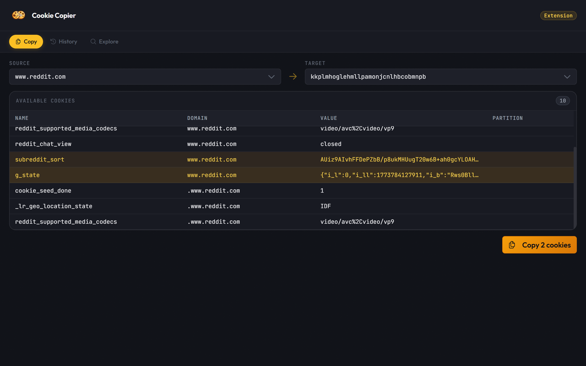
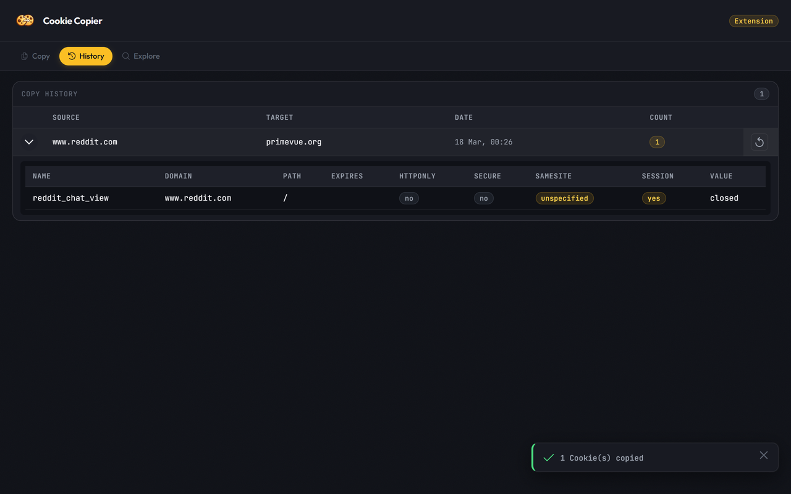
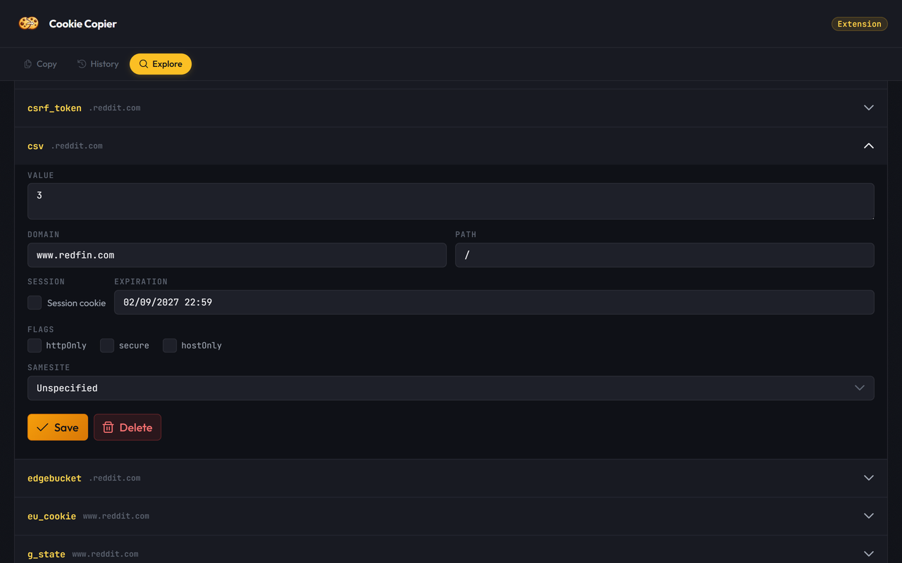

# Cookie Copier

Copy cookies from one domain to another in a few clicks.

## Features

- **Copy cookies** between domains — select a source, pick the cookies you need, and paste them to any target domain
- **Explore & edit** cookies for any domain — view, modify, or delete individual cookies with full control over flags (httpOnly, secure, sameSite, etc.)
- **Copy history** — track past operations and replay them instantly

## Screenshots

| Copy | History | Explore & Edit |
|------|---------|----------------|
|  |  |  |
